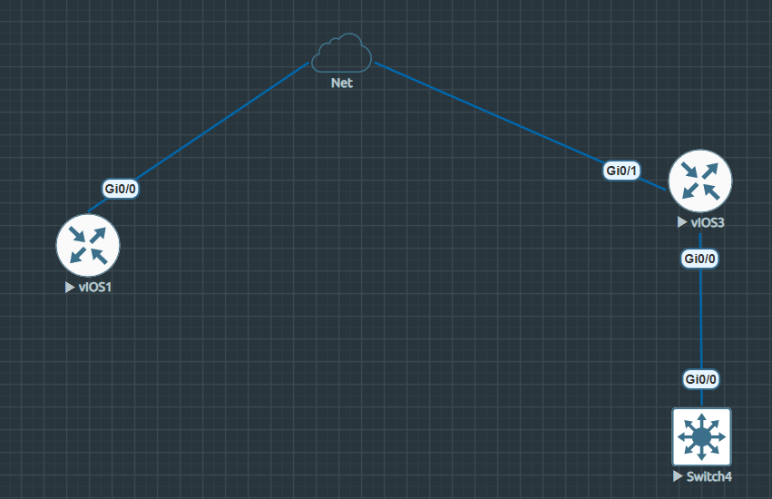

# Netmiko Network Automation

A Python project for automating common network tasks using Netmiko.

The project was built and tested on Cisco devices in an EVE-NG lab.

## Features

* Connect to multiple devices using SSH
* Load device information from YAML
* Collect interface and routing information
* Parse `show ip interface brief` using TextFSM
* Analyze interface status
* Apply and verify configuration changes
* Backup running configurations
* Log automation events
* Run multiple devices concurrently
* Generate an Excel report

## Workflow

```text
Inventory → Connect → Collect → Analyze → Configure → Verify → Backup → Report
```

## Technologies

* Python
* Netmiko
* PyYAML
* TextFSM
* OpenPyXL
* EVE-NG
* Cisco IOS

## Files

```text
network_automation.py
devices.example.yaml
requirements.txt
README.md
.gitignore
```

`devices.yaml`, backups, logs, and generated reports are kept out of the repository.

## Setup

Install the required packages:

```bash
pip install -r requirements.txt
```

Create your own `devices.yaml` based on `devices.example.yaml` and add your device information.

**Do not commit real credentials.**

Run the script with:

```bash
python network_automation.py
```

## Lab

The project was tested with Cisco routers running in EVE-NG and accessed from the Python host using SSH.




## Note

This is a learning project focused on practicing network automation with Python and Netmiko. The automation logic is intentionally simple and can be extended with more network tasks and devices.
